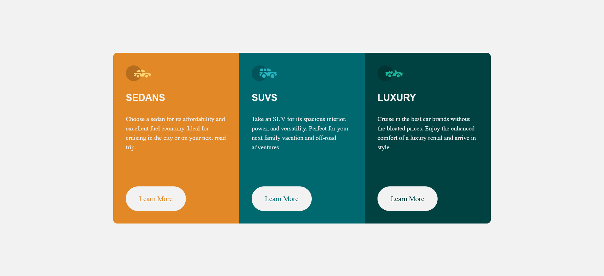

# Frontend Mentor - 3-column preview card component solution
 
## Overview

### The challenge

Users should be able to:

- View the optimal layout depending on their device's screen size
- See hover states for interactive elements

### Screenshot

 

### Links

- Solution URL: [GitHub](https://github.com/Shahzaib-ur-Rehman/3-column-card-component)
- Live Site URL: [3-Column-Card-Component](https://3-column-card-component-teal.vercel.app/)

## My process

### Built with

- Semantic HTML5 markup
- CSS custom properties
- Flexbox
- CSS Grid
- Mobile-first workflow

## Author

- Website - [Shahzaib ur Rehman](https://www.linkedin.com/in/shahzaib-ur-rehman-2518b01b8/)
- Frontend Mentor - [@Shahzaib-ur-Rehman](https://www.frontendmentor.io/profile/Shahzaib-ur-Rehman)